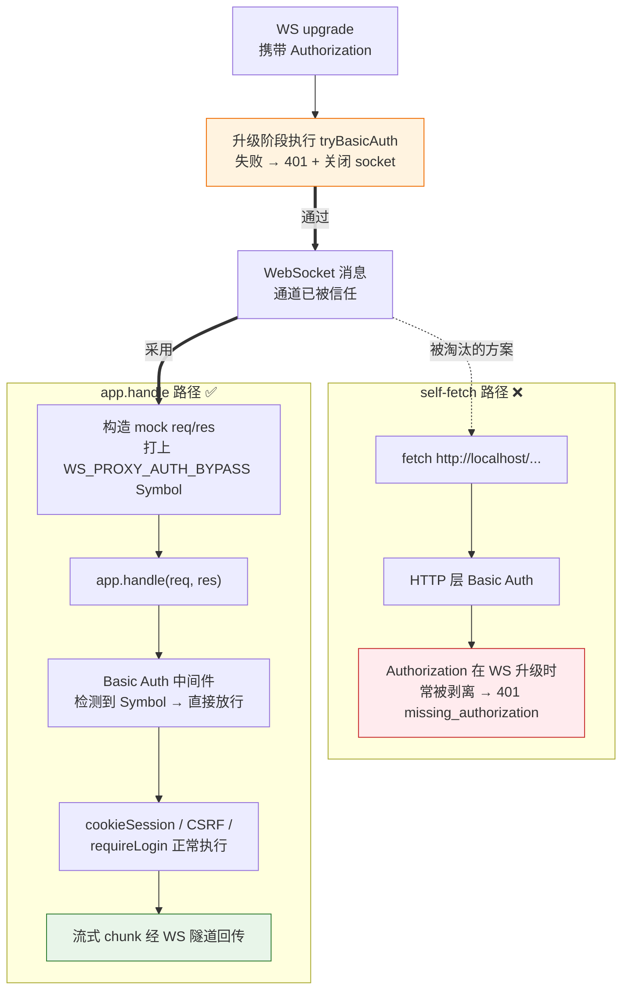

# WebSocket 代理

Luker 提供了 WebSocket（WS）代理功能，通过持久的 WebSocket 隧道传输 AI 生成请求，替代传统的 HTTP 请求方式。这在网络不稳定或受限的环境中尤其有用。

## 什么是 WS 代理

在传统模式下，每次 AI 生成请求都是一个独立的 HTTP 请求。如果网络出现波动，请求可能中断，导致生成结果丢失。

WS 代理将这些请求通过一条**持久的 WebSocket 连接**进行传输。WebSocket 连接一旦建立，就会保持打开状态，所有的生成请求和响应都通过这条连接进行双向通信，无需反复建立新连接。

```mermaid
flowchart LR
    subgraph HTTP[传统 HTTP 模式：每次新连]
        H_C1[客户端] -->|新建 TCP+TLS| H_S1[服务端]
        H_S1 -.|响应+断开| H_C1
        H_C2[客户端] -->|新建 TCP+TLS| H_S2[服务端]
        H_S2 -.|响应+断开| H_C2
        H_C3[客户端] -->|新建 TCP+TLS| H_S3[服务端]
    end

    subgraph WS[WS 代理：持久隧道]
        W_C[客户端] <-->|建立一次 WS 连接| W_S[服务端]
        W_S <-.|心跳保活 + 多请求复用| W_C
    end
```

简单来说：

- **传统 HTTP 模式**：每次生成 → 建立连接 → 发送请求 → 接收响应 → 关闭连接
- **WS 代理模式**：建立一次连接 → 所有生成请求复用这条连接 → 持续通信

## 为什么需要 WS 代理

### 网络不稳定环境

在移动网络、跨国网络或 Wi-Fi 信号较弱的环境中，HTTP 长连接容易因为短暂的网络波动而中断。WS 代理通过心跳保活和自动重连机制，能够更好地应对这些情况。

### 防火墙和代理限制

某些网络环境中，防火墙或企业代理可能会对长时间的 HTTP 连接进行超时断开。WebSocket 协议在建立连接后的通信方式不同于普通 HTTP，在部分场景下能够绕过这些限制。

### 流式生成的可靠性

AI 生成通常使用流式传输（SSE），一次生成可能持续数十秒。WS 代理为流式传输提供了更可靠的底层通道。

## 重连与恢复能力

WS 代理内置了多项健壮性机制：

### 心跳保活

连接建立后，客户端和服务端会定期交换心跳消息，确保连接处于活跃状态。如果一方长时间未收到心跳，会主动检测连接状态。

### 断线自动重连

当 WebSocket 连接意外断开时，客户端会自动尝试重新建立连接，无需用户手动干预。

### 流偏移恢复

如果在 AI 生成过程中连接短暂中断，WS 代理支持**流偏移恢复**——重连后从断点处继续接收生成内容，而不是从头开始。这意味着即使网络闪断，你也不会丢失已经生成的内容。

## 内部调度机制

WS 代理的服务端在转发生成请求时，使用 `app.handle()` 直接调度 Express 路由，而非通过 HTTP 自请求访问 localhost。这样请求依旧经过应用层中间件（cookie session、CSRF、登录检查），但 Basic Auth 这一层 HTTP 网关会在 WS 升级阶段一次性完成验证，派发时不再重复挑战。



### 工作原理

1. **升级阶段鉴权**：当启用 Basic Auth 时，`server.on('upgrade')` 复用 `tryBasicAuth(req)` 验证 `Authorization` 头。验证失败立即写入 401（带 `WWW-Authenticate`）并关闭 socket，浏览器会回落到 HTTP 走原本的 Basic Auth 流程。
2. **派发请求**：从 WS 消息提取 URL/方法/头/体，构造 mock `IncomingMessage`（Readable socket，`req.push()` 注入 body）。
3. **派发标记**：在 mock 请求上挂 `WS_PROXY_AUTH_BYPASS`（Symbol，无法通过 header 或 query 伪造），表示此请求已通过 WS 通道鉴权。
4. **`app.handle(req, res)`**：进入 Express 中间件链——cookieSession 解析 cookie、CSRF 校验 token、requireLogin 校验登录态都正常运行；basicAuth 中间件读到 Symbol 后直接放行。
5. **响应回流**：mock `ServerResponse` 把 status/headers/chunk 经 WS 隧道返回给客户端。

### 为什么不用 self-fetch

通过 localhost HTTP 自请求会再走一遍完整的 HTTP 接入栈，等于让 Basic Auth 中间件再要一次 `Authorization` 头——而 WS 客户端在浏览器/WebView/隧道里 **常常无法在升级阶段附带这个头**（iOS Safari 与套壳 WebView、frpc/cloudflared 之类的反向代理在 WebSocket 升级时会剥掉 `Authorization`），结果就是 401。所以鉴权放在 WS 升级阶段集中校验、派发时跳过重复挑战，让 WS 通道本身成为认证边界。

### 安全边界

- **WS 升级仍然受 Basic Auth 保护**：升级前需要通过 `tryBasicAuth` 验证，未配置 Basic Auth 时则跳过这一层。
- **Symbol 不可伪造**：`WS_PROXY_AUTH_BYPASS` 是模块内部的 Symbol；任何 header、query、body 字段都无法在 `request` 对象上设置同名 Symbol 属性。
- **应用层中间件照常生效**：cookieSession、CSRF、requireLogin 在派发时全部运行，未登录或缺少 CSRF token 的请求依然会被拒绝。

### 连接健壮性

- **心跳保活**：客户端和服务端定期交换心跳消息，防止中间网络设备因空闲超时断开连接
- **流偏移恢复**：生成过程中如果连接短暂中断，重连后可以从断点继续接收内容
- **作业清理**：使用 `lastActivity` 时间戳检测过期作业，而非 `createdAt`，确保活跃中的长生成不会被误清理

## 使用场景

以下场景特别适合使用 WS 代理：

- **移动设备使用** — 手机网络切换（Wi-Fi ↔ 蜂窝）时保持生成不中断
- **远程服务器部署** — Luker 部署在远程服务器上，通过不稳定的网络访问
- **长文本生成** — 生成较长的回复时，减少因超时导致的失败
- **企业网络环境** — 绕过可能干扰长连接的网络设备

::: tip
WS 代理是 Luker 的内部传输优化，对用户来说是透明的——你不需要进行额外配置，Luker 会在适当的时候自动使用。
:::

## 相关页面

- [性能优化](/zh-CN/improvements/performance) — 其他性能改进
- [生成层](/zh-CN/improvements/generation-layer) — Luker 的统一生成架构
